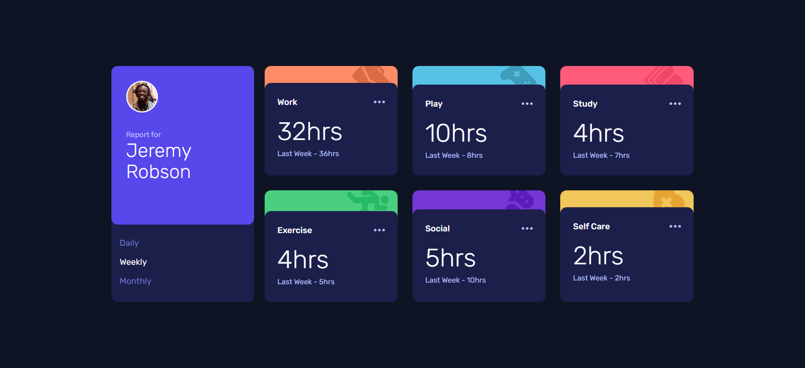
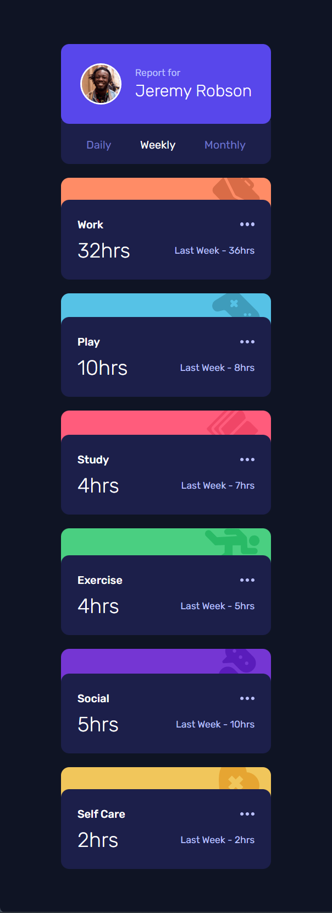

# Time tracking dashboard

Building realistic projects to improve my front-end skills.

## Screenshots

### Links

- Live Site URL: [Time tracking dashboard](https://t1me-tracking-dashboard.netlify.app/)

## Built with

- Semantic HTML5 markup
- Tailwind CSS
- Flexbox
- CSS Grid
- Mobile-first workflow
- [Styled Components](https://styled-components.com/) - For styles
- Media Queries
- DOM Manipulation
